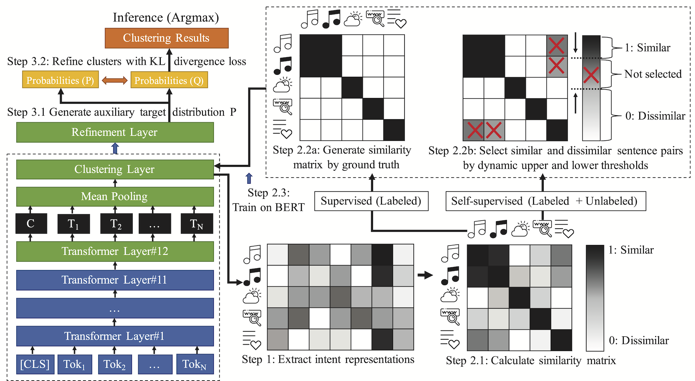

# Discovering New Intents via Constrained Deep Adaptive Clustering with Cluster Refinement

Implementation of the research paper [Discovering New Intents via Constrained Deep Adaptive Clustering with Cluster Refinement](https://arxiv.org/abs/1911.08891)

Identifying new user intents is an essential task in the dialogue system. However, it is hard to get satisfying clustering results since the definition of intents is strongly guided by prior knowledge. Existing methods incorporate prior knowledge by intensive feature engineering, which not only leads to overfitting but also makes it sensitive to the number of clusters. 

In this paper, we propose `constrained deep adaptive clustering with cluster refinement (CDAC+)`, an end-to-end clustering method that can naturally incorporate `pairwise constraints` as prior knowledge to guide the clustering process. Moreover, we refine the clusters by forcing the model to learn from the high confidence assignments. After eliminating low confidence assignments, our approach is surprisingly insensitive to the number of clusters. 

The model architecture of CDAC+:



## Usage
1. Install all required library
```
pip install -r requirements.txt
```

2. Get the pre-trained [BERT](https://storage.googleapis.com/bert_models/2018_10_18/uncased_L-12_H-768_A-12.zip) model and convert it into [Pytorch](https://huggingface.co/transformers/converting_tensorflow_models.html) 


3. Run the experiments by: 
```
python experiment.py <dataset> <factor_of_clusters> <labeled_percentage> <unknown_class_ratio>
python experiment.py snips 1 0.1 0.25`
```

```
dataset: snips | dbpedia | stackoverflow
factor_of_clusters: 1 (default) | 2 | 3 | 4 
labeled_percentage: 0.001 | 0.01 | 0.03 | 0.05 | 0.1 (default)
unknown_class_ratio: 0.25 (default) | 0.5 | 0.75
```


##  Results
### Main experiments
| Method   |       | SNIPS |       |       |DBPedia|       |       | Stack |       |
|:--------:|:-----:|:-----:|:-----:|:-----:|:-----:|:-----:|:-----:|:-----:|:-----:|
| Method   |  NMI  |  ARI  |  ACC  |  NMI  |  ARI  |  ACC  |  NMI  |  ARI  |  ACC  |
| KM       | 71.42 | 67.62 | 84.36 | 67.26 | 49.93 | 61.00 | 8.24  | 1.46  | 13.55 |
| AG       | 71.03 | 58.52 | 75.54 | 65.63 | 43.92 | 56.07 | 10.62 | 2.12  | 14.66 |
| SAE-KM   | 78.24 | 74.66 | 87.88 | 59.70 | 31.72 | 50.29 | 32.62 | 17.07 | 34.44 |
| DEC      | 84.62 | 82.32 | 91.59 | 53.36 | 29.43 | 39.60 | 10.88 | 3.76  | 13.09 |
| DCN      | 58.64 | 42.81 | 57.45 | 54.54 | 32.31 | 47.48 | 31.09 | 15.45 | 34.26 |
| DAC      | 79.97 | 69.17 | 76.29 | 75.37 | 56.30 | 63.96 | 14.71 | 2.76  | 16.30 |
| BERT-KM  | 52.11 | 43.73 | 70.29 | 60.87 | 26.6  | 36.14 | 12.98 | 0.51  | 13.9  |
| PCK-means| 74.85 | 71.87 | 86.92 | 79.76 | 71.27 | 83.11 | 17.26 | 5.35  | 24.16 |
| BERT-KCL | 75.16 | 61.90 | 63.88 | 83.16 | 61.03 | 60.62 | 8.84  | 7.81  | 13.94 |
| BERT-Semi| 75.95 | 69.08 | 78.00 | 86.35 | 72.49 | 75.31 | 65.07 | 47.48 | 65.28 |
| CDAC+    | __89.30__ | __86.82__ | __93.63__ | __94.74__ | __89.41__ | __91.66__ | __69.84__ | __52.59__ | __73.48__ |

### Ablation study
| Method   |       | SNIPS |       |       |DBPedia|       |       | Stack |       |
|:--------:|:-----:|:-----:|:-----:|:-----:|:-----:|:-----:|:-----:|:-----:|:-----:|
| Method   |  NMI  |  ARI  |  ACC  |  NMI  |  ARI  |  ACC  |  NMI  |  ARI  |  ACC  |
| DAC      | 79.97 | 69.17 | 76.29 | 75.37 | 56.30 | 63.96 | 14.71 | 2.76  | 16.30 |
| DAC-KM   | 86.29 | 82.58 | 91.27 | 84.79 | 74.46 | 82.14 | 20.28 |  7.09 | 23.69 |
| DAC+     | 86.90 | 83.15 | 91.41 | 86.03 | 75.99 | 82.88 | 20.26 |  7.10 | 23.69 |
| CDAC     | 77.57 | 67.35 | 74.93 | 80.04 | 61.69 | 69.01 | 29.69 |  8.00 | 23.97 |
| CDAC-KM  | 87.96 | 85.11 | 93.03 | 93.42 | 87.55 | 89.77 | 67.71 | 45.65 | 71.49 |
| CDAC+    | __89.30__ | __86.82__ | __93.63__ | __94.74__ | __89.41__ | __91.66__ | __69.84__ | __52.59__ | __73.48__ |


## Citation
If you find this article useful for your research, please cite it as follows:
```
@inproceedings{lin2020discovering,
  title={Discovering New Intents via Constrained Deep Adaptive Clustering with Cluster Refinement},
  author={Lin, Ting-En and Xu, Hua and Zhang, Hanlei},
  booktitle={Thirty-Fourth AAAI Conference on Artificial Intelligence},
  year={2020}
}
```
